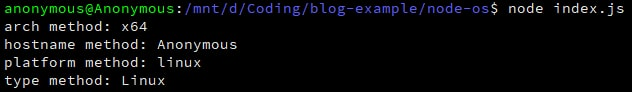

Nowadays, Node.js is everywhere, from frontend, backend, IoT to embedded systems (check out the recent [survey report](https://nodejs.org/static/documents/casestudies/Nodejs_2017_User_Survey_Exec_Summary.pdf) from the Node.js Foundation), all thanks to thousands of super useful open-source libraries. But what task can Node.js handle quickly without using any library? I looked at the Node.js documentation and the answer was this little gem, the [OS API](https://nodejs.org/api/os.html#os_os_freemem).
<!-- more -->

### Before we start
We do not need a web server for this example, but if you need one and also do not want to use any library. I suggest this ["You first Node.js HTTP server"](https://blog.risingstack.com/your-first-node-js-http-server/) article. Otherwise, all you need is `package.json` and a `index.js` files.

Also, I recommend using Node.js version **>= 6.11.2** in order to use most of the ES6 features without having to install any transpile tool such as Babel.

---------------------
### Collect operating system information
Let's start by by importing the `os` module from the Node.js API to our `index.js`.

```javascript
// index.js

const os = require('os');
```
I will use the following provided methods from the documentation: `os.arch()`, `os.platform()` , `os.hostname()`, `os.type()`.

```javascript
// index.js

let arch = os.arch(); // CPU architecture 
let hostname = os.hostname(); // Hostname
let platform = os.platform(); // OS platform
let type = os.type(); // OS type

console.log(`arch method: ${arch}`); // return 'x64'
console.log(`hostname method: ${hostname}`); 
console.log(`platform method: ${platform}`);
console.log(`type method: ${type}`);
```

Let's see the result when I ran the code under the default Window shell as well as my favourite platform, [Window Subsystem for Linux aka WSL](https://msdn.microsoft.com/en-us/commandline/wsl/about):

<div class="text-center mb-2">
    
    Pic 1.1: Window
</div>

<div class="text-center mb-4">
    
    Pic 2.1: Winow Subsystem for Linux
</div>

So it is pretty easy to get some basic information about the CPU architecture, hostname, OS type & system platform. By using the WSL, I was able to test the code in both Linux and Window environment without much overhead **(thanks Microsoft <3)**.

---------------------
### Collect RAM information
Whenever RAM is mentioned, most of us only care about the total amount of RAM and how many free RAM we have left on our computers. Node.js API got you covered by giving us the `os.freemem()` and ` os.totalmem()` methods so let’s put them into our `index.js`.

```javascript
// index.js

let freeRam = os.freemem(); // Unused amount of RAM
let totalRam = os.totalmem(); // Total amount of RAM
let usedRam = totalRam - freeRam; // Simple math eh...

console.log(`free ram: ${freeRam} bytes ~ ${Math.floor(freeRam / 1000000)} megabytes ~ ${Math.floor(freeRam / 1000000000)} gigabytes`);
console.log(`total ram: ${totalRam} ~ ${Math.floor(totalRam / 1000000)} megabytes ~ ${Math.floor(totalRam / 1000000000)} gigabytes`);
console.log(`=> used Ram = totalRam - freeRam = ${usedRam} ~ ${Math.floor(usedRam / 1000000)} megabytes ~ ${Math.floor(usedRam / 1000000000)} gigabytes`);

// Output:
// free ram: 3517329408 bytes ~ 3517 megabytes ~ 3 gigabytes
// total ram: 8429346816 ~ 8429 megabytes ~ 8 gigabytes
// => used Ram = totalRam - freeRam = 4912017408 ~ 4912 megabytes ~ 4 gigabytes
```

The code is pretty straightforward:
1. Get the total amount of RAM = *totalRam*.
2. Get the unused amount of RAM = *freeRam*.
3. Calculate the free amount of RAM by subtracting *freeRam* from *totalRam*.
4. Convert the resulting numbers from *byte* to *gigabyte*. \*

\* *I used 1 Gigabyte = 1,000 Megabytes = 1,000,000 Kilobytes = 1,000,000,000 Bytes so you will see the final outcome did not add up, but still close enough.*

---------------------
### Summary
And that is it for part 1 of the series. You now know how to obtain some basic info about the underlying operating system and RAM of your computers without having to install any external library.

This is my first time writing an article so many people might find my style boring and not coherent. Because of that, I would be very appreciated if you could give me some advices on what I should correct or improve (grammar, writing style, code, etc) in the comment section below. If you are still interested in this series, you can find part 2 [here](/playing-with-nodejs-part-2). 

Thank you for reading till the end :D
