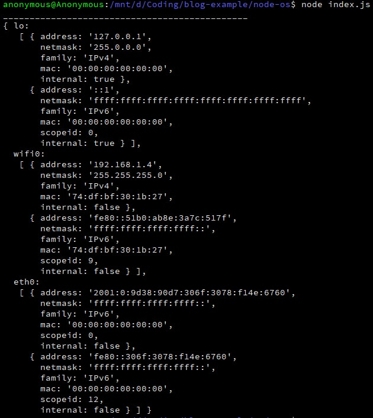
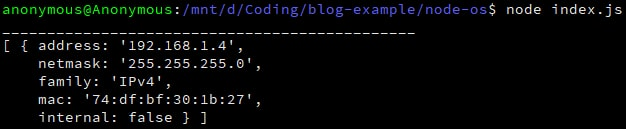
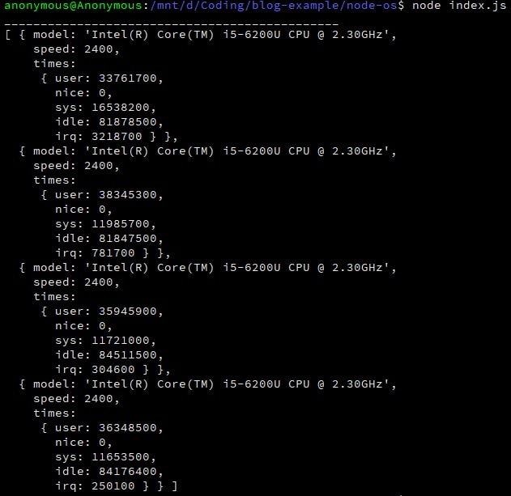
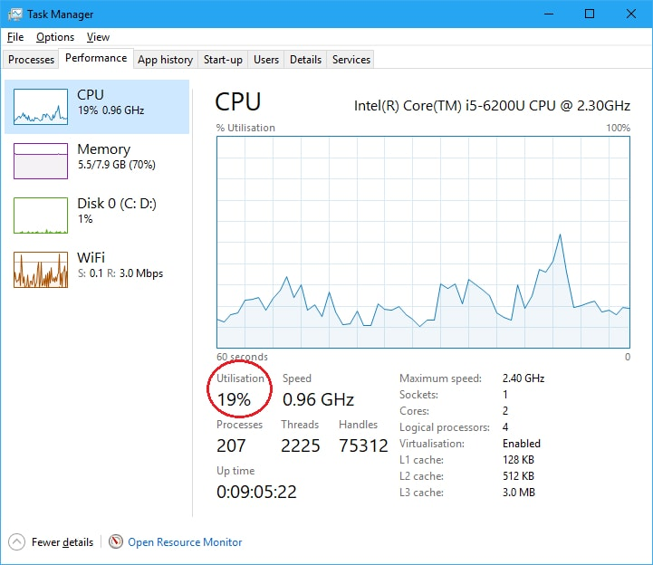
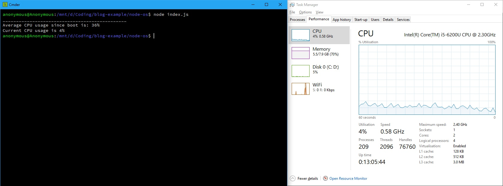

Welcome to the second part of the series, where I will show you how to get the network and CPU information of your machines with the Node.js OS API. If you have not read the first part which introduces you to the OS API yet, you can find it [here](/blog/playing-with-nodejs-part-1/). 
<!-- more -->

---------------------
### Collect network information
Search "How to get IP address in nodejs" on Google and people will suggest you to install the `ip` library. Very clean solution indeed, but why should we install extra package when the Node.js API gives you this, the `os.networkInterfaces()` method. 

First, import the `os` package then call the desired method.

```javascript
// index.js

const os = require('os'); // import OS API
const interfaces = os.networkInterfaces();
```

Run the code via the terminal and see the result:

<div class="text-center mb-2">
    
    Pic 1.1: List of network interfaces
</div>

It can be seen that my Window machine has 3 network interfaces in total: 
- **etho0**: the ethernet network.
- **lo**: the loopback interface.
- **wifi0**: the wireless network.

As the result, calling the `os.networkInterfaces()` method will return an object containing all network interfaces under the your operating system, each interface is an array with 2 item which represents the IPv4 and IPv6 data respectively. The next step is to extract the public IP of our machines which, in my case, is the IPv4 address of the wireless network.

Question: how to retrieve one object out of a mess? The answer is `map` and `filter`.

```javascript
// index.js

// Since the interfaces variable is an object, not an array so map and filter can not be used on it. 
// Instead, we will extract each network interface inside the interfaces object and put them into a seperate array.
const interfaces = os.networkInterfaces();
let networks = [];

// Apply Objects.keys to interfaces variable in order to use the map method
let result = Object.keys(interfaces).map(x => { 
    interfaces[x].map(x1 => {
    networks.push(x1);
    });
});

// Once we got the array of intefaces, use filter to bring out the piece of data that we want
let theChosenOne = networks.filter(x => {
    return ( x.internal === false && x.family === 'IPv4');  // Because I want to get the public IPv4 address
});

console.log(theChosenOne);
```

Run the code again and ta-da, I have successfully obtain an object that holds all information that I need such as the public IPv4 address, the MAC address, etc.

<div class="text-center mb-2">
    
    Pic 1.2: The final result.
</div>

**Note: If you are connecting both ethernet and wireless interfaces to the Internet then the above code will result in an array of 2 items. Some external program like Docker will create a virtual ethernet interface which exposes itself to the Internet and thus, produce the same side effect when you execute the code.**

---------------------
### Collect CPU information
In the final chapter of this series, we will look at the brain of every computers, the CPU. The only method we will be using is os.cpus() and it provides nearly everything we want to know about the CPU.

As usual, import the `os` package then call `os.cpus()`:

```javascript 
// index.js

const os = require('os');
const cpus = os.cpus();
console.log(cpus);
```

Run the `index.js` file via the terminal:

<div class="text-center mb-2">
    
    Pic 2.1: CPU information.
</div>

From the `model` attribute, we can already deduce the CPU model which, on my machine, is the Intel Skylake, Core i5, model 6200U 2.3Ghz with 2 Cores and 4 Threads.

The `times` attribute contains some interesting numbers and the documentation did explain a bit about what these numbers are so I will not talk about their meanings here; instead, I will show you how to calculate the almost-real-time CPU usage and it should be somewhat close to the CPU utilisation number as shown in the Task Manager.

<div class="text-center mb-2">
    
    Pic 2.1: Task Manager.
</div>

Using the instructions [here](https://github.com/Leo-G/DevopsWiki/wiki/How-Linux-CPU-Usage-Time-and-Percentage-is-calculated) as the reference, the code is as follows:

```javascript
// index.js

const os = require('os');
let currentCpuData = getCpuData();
// Average CPU usage since boot, this is not what we are looking for though
// but it is nice to know :)
avgCpuUsage = Math.round(currentCpuData.cpuUsage / currentCpuData.cpuTotal * 100); 
console.log(`Average CPU usage since boot is: ${avgCpuUsage}%`);

// The trick is to wait 1 second, then get the CPU data again.
setTimeout(() => {
    let newCpuData = getCpuData();
    // Total CPU time difference between 2 moments
    let cpuTotalDiff = newCpuData.cpuTotal - currentCpuData.cpuTotal;
    // Cpu usage time difference between 2 moments
    let cpuUsageDiff = newCpuData.cpuUsage - currentCpuData.cpuUsage;
    // Current CPU usage, this is what we want :D
    let realCpuUsage = Math.round(cpuUsageDiff / cpuTotalDiff * 100);
    console.log(`Current CPU usage is ${realCpuUsage}%`);
}, 1000);

// The piece of code being used to calculate CPU data is put into a function to avoid code redundancy.
function getCpuData() { 
    let cpuTotal = 0; // total CPU time since boot
    let cpuIdle = 0; // total CPU idle time since boot
    let cpuUsage = 0; // total CPU usage time since boot
    os.cpus().map(cpu => {
    cpuTotal += cpu.times.user + cpu.times.sys + cpu.times.irq + cpu.times.idle + cpu.times.nice;
    cpuIdle += cpu.times.idle;
    });
    cpuUsage = cpuTotal - cpuIdle;
    return {cpuTotal, cpuUsage};
}
```

Due to many factors such as GUI delay, the result after running the code is usually not the same CPU utilisation number as shown in the Task Manager, but it should acceptably be close enough.

<div class="text-center mb-2">
    
    Pic 2.1: The CPU usage output.
</div>

We can then use `setInterval` so that this number can be updated, for example, every 5 seconds. You can see this as an additional exercise :)

---------------------
### Summary
That is the end of this series. You now know how to obtain some basic info about the network interfaces as well as the CPU usage of your machines without having to install any external library. The Node.js OS API has many other methods that I did not cover in this series so if you are interested, visit the official documentation [here](https://nodejs.org/api/os.html) to learn more.

Thank you for reading :D